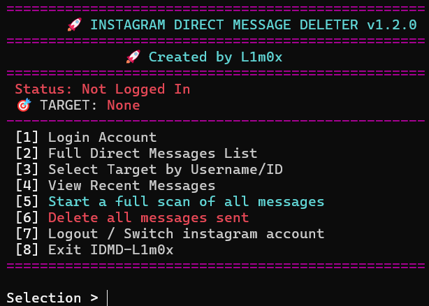

# Project: INSTAGRAM DIRECT MESSAGE DELETER

<p align="center">
  
</p>

A Python tool using [instagrapi](https://github.com/adw0rd/instagrapi) to:
- Log in to Instagram with session persistence
- Full Direct Messages List & Groups
- View all messages (texts,voice messages,calls,reels,videos,photos)
- Search all messages greek,english,numbers,voice messages,photos,videos,reels
- **Delete all messages sent** your own messages that match search criteria

---

## ?? Disclaimer
This tool interacts with Instagram's private APIs and may violate Instagram's Terms of Service.  
**Use at your own risk.** Your account may be subject to temporary or permanent restrictions.

---

### Step 1: Install Python

Python is the programming language this tool is written in. You need to install it first.

#### For Windows:
1. Go to [python.org/downloads](https://www.python.org/downloads/)
2. Click the yellow "Download Python 3.x.x" button
3. Run the installer
4. **IMPORTANT**: Check the box that says "Add Python to PATH" at the bottom
5. Click "Install Now"
6. Wait for installation to complete

#### For Mac:
1. Open Terminal (press Cmd+Space, type "Terminal", press Enter)
2. Install Homebrew if you don't have it:
   ```bash
   /bin/bash -c "$(curl -fsSL https://raw.githubusercontent.com/Homebrew/install/HEAD/install.sh)"
   ```
3. Install Python:
   ```bash
   brew install python3
   ```

#### For Linux (Ubuntu/Debian):
1. Open Terminal
2. Run these commands:
   ```bash
   sudo apt update
   sudo apt install python3 python3-pip
   ```

**Verify Python is installed:**
Open Terminal (or Command Prompt on Windows) and type:
```bash
python3 --version
```
You should see something like "Python 3.x.x"

---

### Step 2: Download INSTAGRAM DIRECT MESSAGE DELETER

You have two options:

#### Option A: Download as ZIP (Easier for beginners)
1. Click the green "Code" button at the top of this page
2. Click "Download ZIP"
3. Extract the ZIP file to a folder you can find easily (like your Desktop or Documents)
4. Remember where you saved it!

#### Option B: Using Git (If you have git installed)
1. Open Terminal/Command Prompt
2. Navigate to where you want to save the tool:
   ```bash
   cd Desktop
   ```
3. Clone the repository:
   ```bash
   git clone https://github.com/L1m0x/IDMD-L1m0x.git
   cd IDMD-L1m0x
   ```

---

### Step 3: Install Required Libraries

This tool needs a library called "instagrapi" to work with Instagram.

1. Open Terminal/Command Prompt
2. Navigate to the folder where you saved this tool:
   ```bash
   cd path/to/IDMD-L1m0x
   ```
   Example on Windows: `cd C:\Users\YourName\Desktop\IDMD-L1m0x`
   Example on Mac/Linux: `cd ~/Desktop/IDMD-L1m0x`

3. Install the required library:
   ```bash
   pip3 install instagrapi
   ```
   Or if that doesn't work, try:
   ```bash
   pip install instagrapi
   ```

4. Wait for the installation to complete. You'll see a success message when it's done.

---

### Step 4: Run the Tool

Now you're ready to use the tool!

1. Make sure you're in the tool's folder (from Step 3)
2. Run the tool:
   ```bash
   python3 IDMDL1m0x.py
   ```
   Or if that doesn't work, try:
   ```bash
   python IDMDL1m0x.py
   ```

3. You should see a menu like this:
   ```
==================================================
       🚀 INSTAGRAM DIRECT MESSAGE DELETER v1.2.0
==================================================
              🚀 Created by L1m0x
==================================================
 Status: Not Logged In
 🎯 TARGET: None
--------------------------------------------------
 [1] Login Account
 [2] Full Direct Messages List
 [3] Select Target by Username/ID
 [4] View All Messages
 [5] Start a full scan of all messages
 [6] Delete all messages sent
 [7] Logout / Switch instagram account
 [8] Exit IDMD-L1m0x
==================================================
   ```

---

### Step 5: Login to Instagram

1. Type `1` and press Enter
2. Enter your Instagram username
3. Enter your Instagram password (it will be hidden for security)
4. Wait for login to complete

**Note:** Your login information is stored locally on your computer and is used only to connect to Instagram. The IDMD saves your session so you don't have to login every time.

---

### Step 6: Select a Conversation

You have two ways to select a conversation:

#### Option A: List All Direct Messages
1. Type `2` and press Enter
2. You'll see a list of all conversations with usernames,thread id
2. For older conversations write M and hit enter the go to the next list
3. Type the number of the conversation you want and press Enter

#### Option B: Select by Username
1. Type `3` and press Enter
2. Type the Instagram username of the person whose conversation you want to open
3. Press Enter

---

#### Optional Option: View Recent Messages
1. Type `4` and press Enter
2. You will see all messages that you recaived and send
3. Press Enter

### Step 7: Full scan of messages

1. You will see a message Start scan... Please wait (will take some minutes)
2. This will be scan the conversation and will get all the messages,texts,reels,voice messages,videos,photos that you exchanged
3. When the scan will finish you will see a message 
============================================================
✅ The scan is completed!
------------------------------------------------------------
 📝 Texts:    6148 Ammount of total texts
 🎬 Reels:      0 Ammount of reels
 🎤 Voice Messages:    217 Ammount of Voice Messages
 🖼️ Media:      77 Ammount of media like photos,videos

============================================================
 🚀 ABOUTIONS REFERRING:
 Yours (will be deleted): 4298
 Other (They will remain): 2144
============================================================
 🚀 TOTAL FOR DELETION: 4298
============================================================

4. Press Enter

#### Step 8: Delete all messages that was sent
1. Type `6` and press Enter
2. Type YES
3. You'll see a list [1/190 Messages] ID:4354654 (ID OF THE MESSAGE) | THE MESSAGE THAT WILL BE DELETED
4. After this all messages will be deleted one by one with delay 1.5 sec

---
## ? FAQ (Frequently Asked Questions)

### Q: Will this delete the other person's messages too?
**A:** No! The IDMD only deletes (unsends) YOUR messages. The other person's messages will remain in the conversation.

### Q: Can the other person still see my messages?
**A:** After you unsend a message, it will disappear from both your conversation and the other person's conversation, just like using Instagram's "Unsend" feature manually.

### Q: Is this safe to use?
**A:** The tool uses Instagram's private API, which technically violates their Terms of Service. Use at your own risk. Instagram might temporarily limit your account if you delete too many messages too quickly.

### Q: How fast can I delete messages?
**A:** The tool has built-in delays (1.5 second between each deletion) to avoid triggering Instagram's spam detection. Be patient and don't try to rush it.

### Q: I got an error about "pip not found"
**A:** This means pip isn't installed or isn't in your system PATH. Try:
- Windows: Use `python -m pip install instagrapi` instead
- Mac/Linux: Use `python3 -m pip install instagrapi` instead

### Q: The tool says "instagrapi not installed"
**A:** You need to install the required library. Go back to Step 3 in this guide.

### Q: I get a "login failed" error
**A:** This could mean:
- Wrong username/password
- Instagram is blocking login attempts (try again later)
- You have 2-factor authentication enabled (this tool might not work with 2FA)

### Q: Can I delete messages from group chats?
**A:** Yes! The tool works with both individual conversations and group chats. Just select the group chat when choosing a thread.

### Q: Does this work on mobile?
**A:** No, this tool is designed to run on computers (Windows, Mac, or Linux,Termux). You need a computer, termux with Python installed.

---

## ?? Troubleshooting

### Problem: "Python not found" or "'python' is not recognized"
**Solution:** 
- Make sure Python is installed (see Step 1)
- Try using `python3` instead of `python`
- On Windows, you might need to use `py` instead of `python`

### Problem: "Permission denied" error
**Solution:**
- On Mac/Linux, try adding `sudo` before the command: `sudo pip3 install instagrapi`
- You might need administrator privileges

### Problem: Tool is very slow
**Solution:**
- This is normal! The tool has delays to avoid Instagram's spam detection
- Deleting 100 messages takes about 2-3 minutes
- Be patient and let it run

### Problem: "Rate limit exceeded" or account temporarily locked
**Solution:**
- You're deleting too many messages too quickly
- Wait a few hours before trying again
- Try deleting smaller batches (100-200 messages at a time)

### Problem: Messages aren't being deleted
**Solution:**
- Make sure you're searching for messages YOU sent (only your messages can be unsent)
- Check that you typed "YES" in capital letters when confirming
- Try logging out (exit the tool) and logging in again

---

## ?? Technical Details

### Requirements
- **Python 3.6+**
- [instagrapi](https://pypi.org/project/instagrapi/) library
- An Instagram account

### Features
- Session persistence (stay logged in between uses)
- Proper cursor-based pagination (can handle thousands of messages)
- Bulk unsend functionality
- User-friendly command-line interface

---

## ?? Support

If you're still having trouble:
1. Read through this guide again carefully
2. Check the Troubleshooting section
3. Make sure you followed each step exactly
4. Open an issue on GitHub with details about your problem

---

## ?? License

This project is licensed under the terms specified in the LICENSE file.

---

## ?? Credits

This tool uses the [instagrapi](https://github.com/adw0rd/instagrapi) library for Instagram API interactions.
This tool is upgraded,and edited with added deleting all messages including texts,videos,photos,voice messages,reels in greek and english language only.
Base of the IDMD-L1m0x was https://github.com/startingfrom0rating/Instagram-Message-Deleter big thanks to https://github.com/startingfrom0rating


